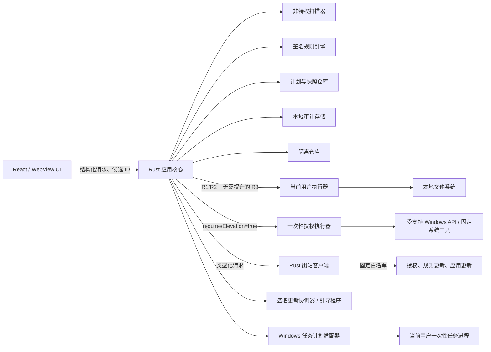

# 清盘设计文档：安全、恢复与目标架构

> 文档集：[Windows磁盘清理工具（聚合主流工具精华）开发设计文档.md](<../../Windows磁盘清理工具（聚合主流工具精华）开发设计文档.md>)
> 规范章节：第 5-7 章
> 状态与版本继承自主索引；本文件不单独构成批准对象。

[上一篇：产品范围](01-product-scope.md#qpn-sec-1) · [主索引](<../../Windows磁盘清理工具（聚合主流工具精华）开发设计文档.md>) · [下一篇：运行时 API](03-runtime-api.md#qpn-sec-8)

---

## 5. 安全、隐私与恢复模型

### 5.1 保护资产

- 用户文件、应用状态、凭据和隐私数据。
- Windows 系统完整性、启动能力、更新能力和驱动回滚能力。
- 清理规则、签名公钥、更新通道和授权凭据。
- 隔离内容、恢复清单和本地审计记录。
- 用户对“可恢复”“不可恢复”“回收估算”和“可用空间变化观测”的正确理解。

### 5.2 威胁与故障模型

| 威胁或故障 | 必需缓解措施 |
|---|---|
| 扫描后文件被替换 | 保存稳定身份、大小、时间和属性；执行前使用句柄重新验证 |
| 符号链接、Junction、挂载点或路径穿越 | 不跟随重解析点；逐级验证父目录；规范化后仍须位于允许根 |
| 硬链接导致错误计量或删除 | 使用卷和 File ID 去重；同一文件的多个目录项不计为可释放重复项 |
| 云占位、同步目录或网络路径 | 默认排除；“释放本地空间”必须使用云提供方受支持接口另行设计 |
| 恶意、损坏或重放的规则包 | 签名、schema/能力校验、单调序列、事务激活和恢复密钥撤销 |
| 同 SID 恶意进程回退用户态状态 | 签名和能力包络仍生效；高水位缺失/冲突时关闭规则清理；不宣称通用 Windows ACL 能隔离同 SID 进程 |
| 前端命令注入 | 后端只接受结构化请求和 ID；不调用命令解释器；系统工具使用固定可枚举参数 |
| UAC/提权边界滥用 | 一次性执行器、窄接口、命名管道 ACL、随机 nonce、计划摘要和超时退出 |
| 磁盘写满、断电或进程崩溃 | 写前空间检查、临时文件+原子重命名、逐项提交、可重放审计、部分成功状态 |
| 审计泄露敏感路径 | 默认不记录完整路径；必要字段使用 DPAPI 保护并限制当前用户访问 |
| 本地管理员或内核级攻击者 | 不在产品保证范围；文档不得宣称能抵御拥有同等或更高权限的攻击者 |

### 5.3 安全不变量

1. **INV-001 允许列表**：未匹配有效规则的内容不得进入默认清理计划。
2. **INV-002 ID 而非路径**：后端不得接受前端提供的任意文件路径作为删除指令。
3. **INV-003 新鲜计划**：文件候选计划必须来自最近一次成功的相关清理扫描，默认有效期 30 分钟；新的清理规则扫描、应用重启、规则版本变化或被引用卷变化会使旧计划失效。无关的空间、重复文件或其他 R0 扫描本身不使既有清理计划失效。
4. **INV-004 单次消费**：每个计划只能消费一次；重复执行返回 `STALE_PLAN`。
5. **INV-005 可观察身份**：路径、父目录链或可观察的文件身份字段任一变化时必须跳过；不得声称能检测保留全部元数据的恶意等长内容改写。
6. **INV-006 不越界**：不跟随重解析点，不对扫描根执行递归目录删除，不通过夺取所有权强制删除。
7. **INV-007 未知即保留**：无法确认进程状态、云状态、文件身份或恢复前置条件时必须保留文件。
8. **INV-008 自动化上限**：R2-R4 必须由用户显式选择；自动任务不得包含 R2-R4。
9. **INV-009 系统接口**：R3 不直接删除 WinSxS、DriverStore、VSS 或系统保护目录，只能调用明确受支持的 Windows 接口。
10. **INV-010 更新失败关闭**：候选规则在激活前失败时保持当前 active 包；已激活包随后损坏或高水位异常时关闭规则清理，不静默回退低序号包。
11. **INV-011 隔离不降级**：隔离失败不得自动降级为永久删除。
12. **INV-012 本地隐私**：本地用户文件内容、文件名、完整路径、文件哈希、扫描结果和本地日志不得通过任何允许的联网通道发送。由已验签规则 index 或应用 manifest 固定的规则/应用制品摘要不属于“本地文件哈希”，但只能用于第 5.7 节对应的固定更新端点。
13. **INV-013 更新结果未知即停止**：应用安装、重启边界、试运行或回滚结果无法由 MSI/二进制/journal 一致证明时，必须进入 `recoveryRequired`；不得声称仍是旧版、已更新或自动重试结果未知的安装调用。
14. **INV-014 先验证隔离容器、后删除源文件**：R2 源删除前必须证明 QPC1 加密容器已耐久发布、全部 AEAD tag/顺序/长度与明文 SHA-256 已通过独立解密验证、DPAPI 包装密钥可解开、仓库安全描述符和 quota charge 已提交，且源内容 guard 未 break。删除进入 `callPrepared` 后不得重调；任一事实不明时保留现有对象并进入 `sourceRetained/recoveryRequired`，不得报告隔离成功。

#### 5.3.1 文件句柄执行协议

SAFE-001~005 的规范算法适用于 R1 永久删除、R2 隔离、R4 原文件删除和隔离清除，而不只适用于扫描：

1. 唯一允许的绝对路径打开是由后端卷枚举得到并规范化的 `\\?\Volume{GUID}\` 卷根；使用 `CreateFileW`、`FILE_FLAG_OPEN_REPARSE_POINT` 和 `FILE_FLAG_BACKUP_SEMANTICS` 后，必须从句柄反查卷 GUID、卷序列、文件系统与“确为卷根”事实，并与授权/快照绑定值一致。配置根、内置 resolver 根、授权根及其全部中间组件都不得以完整绝对路径直接打开：从已验证卷根开始，每个组件统一使用 `NtCreateFile` 的 `OBJECT_ATTRIBUTES.RootDirectory=已验证父句柄`、`OBJ_DONT_REPARSE`、`FILE_OPEN_REPARSE_POINT` 及与对象类型匹配的 create options；每个卷根以下的授权根和祖先目录 share mode 精确允许 `FILE_SHARE_READ | FILE_SHARE_WRITE`、拒绝 `FILE_SHARE_DELETE`，并保持全部句柄到 item 终态提交。无法取得这种 share 语义即返回 `FILE_LOCKED`，不得先释放冲突句柄再执行。检查当前组件没有 reparse tag 后才允许下降到下一层。仓库对象、恢复临时文件和目录枚举遵循同一规则，不再拼接绝对路径后二次打开。应用重启后必须从卷根按同一算法重建全部持久根/父链并重验每级身份，不能采用保存的路径句柄结果或跳过中间组件；任一级 API/Windows build 无法提供这些语义时返回 `UNSUPPORTED_FILESYSTEM/FILE_LOCKED/PARENT_CHANGED/REPARSE_POINT`，不得退化为路径字符串操作。
2. 以所需读属性/删除权限打开候选，允许其他进程只读但拒绝 `FILE_SHARE_WRITE` 和 `FILE_SHARE_DELETE`。从该句柄读取最终路径、卷/File ID、FILETIME、USN、链接、流和属性并与快照比较；不存在返回 `FILE_NOT_FOUND`，任何不确定状态失败关闭。
3. R1/R2 源删除/R4 删除只使用同一已验证候选句柄的 `SetFileInformationByHandle(FileDispositionInfoEx)`，`Flags` 精确为 `FILE_DISPOSITION_FLAG_DELETE (0x00000001)`；显式禁止 `POSIX_SEMANTICS`、`FORCE_IMAGE_SECTION_CHECK`、`ON_CLOSE` 和 `IGNORE_READONLY_ATTRIBUTE`，也不得先修改只读属性来绕过策略。不支持 Ex 版本时只允许使用经专项平台测试的 `FileDispositionInfo(DeleteFile=TRUE)`。紧邻 mutation 前，在所有祖先仍拒绝 share-delete 的排他窗口内，从卷根到直接父目录逐级重读 normalized name、parent File ID、当前 File ID 和 `DeletePending=false`，再重读候选身份/直接父目录项；该拓扑复检与 disposition 之间不得释放、替换或降级任何根/父链句柄，因此祖先 rename/delete 无法插入。任一级变化返回 `PARENT_CHANGED`，不得在复检后再按路径调用 `DeleteFile/RemoveDirectory`。关闭候选句柄前保持父链句柄，关闭后从固定父句柄验证旧目录项已不存在。
4. R2 不 rename 源文件、不修改源 owner/DACL/继承/属性/数据流。临时/最终 QPC1 容器、恢复目录和导出临时文件都在固定父句柄下以 `CREATE_NEW` 创建；仓库内发布仅把产品新建临时容器以句柄相对 `FILE_RENAME_INFO_EX` 改成后端随机最终名，禁止 replace。容器及所有父链句柄保持到发布/导出终态。
5. 提交或安全跳过后才释放候选、父链和根句柄。目标文件系统或 Windows build 不支持所需句柄语义时，该写能力返回 `UNSUPPORTED_FILESYSTEM`，不得回退为按路径执行。

### 5.4 五级风险模型

| 等级 | 定义 | 默认动作 | 确认 | 自动化 | 例子 |
|---|---|---|---|---|---|
| R0 | 只读分析，不改变系统 | 无写操作 | 不需要 | 可预先配置本地分析根后调度 | 空间分析、重复文件扫描、分区展示 |
| R1 | 明确可重建、低影响缓存 | 永久删除单个快照文件 | 执行计划总确认 | 仅限用户预批准 | 关闭应用后的版本化 Cache 叶子目录 |
| R2 | 可能影响应用状态或属于用户文件，但可安全隔离 | V1 固定使用产品隔离 | 用户逐类选择；原生页按类分组后一次确认不可变计划 | 禁止 | 通用 Temp、日志/崩溃材料、用户大文件、聊天媒体 |
| R3 | 通过受支持系统接口或外部安装器改变系统/应用状态，可能需要管理员权限 | 官方 API/已验证卸载器 + 专用备份（适用时） | 逐项确认；接口需要时 UAC | 禁止 | 应用卸载、有证据的注册表修复、组件维护、旧驱动卸载 |
| R4 | 不可逆或恢复不受产品控制 | 永久删除或设备擦除 | 独立风险页 + 二次确认 | 禁止 | 用户文件永久删除、HDD 尽力覆写、设备 sanitize |

风险等级由规则和执行方式共同决定。把同一文件从隔离改为永久删除时，必须重新计算风险和确认要求。

“按类分组后一次确认”不表示分类可以折叠或省略：每个 plan item 固化 `confirmationCategoryId`，计划保存逐类计数、逻辑大小、风险、动作和恢复摘要；原生确认页必须逐类展示全部摘要，最终一次确认只授权该 `planHash`。R2 item 不能预选；增加、删除或变更任一分类/item 都必须创建新计划并重新确认。

### 5.5 隔离与导出副本

本节展开 REC-001~007、INV-011 与 INV-014。V1 R2 固定使用“认证加密容器 copy-full-verify-delete”，不再使用源文件 rename/DACL 覆盖模型。

V1 只接收本地普通文件：非 EFS、非云占位、非重解析、非 sparse/compressed、非只读，`hardLinkCount=1`、`streamCount=1`（只有未命名数据流）、身份稳定且 `DeletePending=false`。源句柄一次申请 `FILE_READ_DATA/FILE_READ_ATTRIBUTES/READ_CONTROL/DELETE/SYNCHRONIZE`，share mode 只允许 `FILE_SHARE_READ`；任何冲突返回 `FILE_LOCKED`。随后以 `FSCTL_REQUEST_OPLOCK` 和 `REQUEST_OPLOCK_INPUT_FLAG_REQUEST` 请求并保持 `OPLOCK_LEVEL_CACHE_READ | OPLOCK_LEVEL_CACHE_WRITE | OPLOCK_LEVEL_CACHE_HANDLE`，异步 break channel 与 record/attempt 绑定。只有目标 Windows build/文件系统通过真实 `PAGE_READWRITE` mapped-view fixture，证明既有 writable section 会阻止 grant 或在后续写前产生可观察 break 时，才可把该能力标为 supported；无法取得/证明 guard 返回 `QUARANTINE_CONTENT_GUARD_UNAVAILABLE` 并保留源文件。任何 break 在 `removedVerified` 前都会阻止新的源删除：容器未发布时停止并受限清理产品临时对象，已发布时进入 `sourceRetained`，删除调用边界不明时进入 `recoveryRequired`。

每个源卷建立当前用户专属仓库。仓库根和每个新建容器使用显式受保护 security descriptor：owner 为当前 TokenUser SID、group 为当前 token primary group、DACL 仅授予当前用户和 `SYSTEM` 所需访问、禁用继承，mandatory label 必须等于 medium 或更高且 `NO_WRITE_UP` 生效；当前进程不是 medium、任一 owner/group/DACL/label 无法设置或重读不等时返回 `QUARANTINE_UNAVAILABLE`。`QuarantineObjectIdentity` 绑定这些字段，因而不依赖源文件 owner，也不改写源安全描述符。原路径、安全描述符、明文 SHA-256 和 DEK 仅以 DPAPI CurrentUser 范围密文保存在受保护状态中。

默认配额为“卷容量的 10% 与 20 GB 中较小者”。配额按实际 allocation 计入全部容器、临时对象、WAL、清单、索引和元数据。每个 R2 prepare 在单个 per-volume CAS 中创建 record、`QuotaReservation` 和 `prepared`，upper bound 覆盖 QPC1 header、4 MiB 分块密文、每块 tag、manifest、WAL、簇舍入及固定格式开销。准入等式仍为 `knownChargeBytes + activeReservationUpperBoundBytes + newUpperBoundBytes + safetyReserveBytes <= quotaLimitBytes` 且 `unknownChargeCount == 0`；所有项取同一 ledger revision并做无符号溢出前检查。64 MiB `safetyReserveBytes` 只供仓库基础设施。`active` reservation 不按 TTL 释放；`prepared/sourceDigestPrepared/containerPrepared/copying/copied/containerVerified` 保留 reservation，`containerCommitted/sourceDeletePrepared/sourceRemovedVerified/committed/sourceRetained` 保留 charge。只有证明源仍在且没有任何临时/最终容器时才可原子释放 reservation；账本、对象或 allocation 不明则创建/保留 `accountingUnknown` 并关闭新隔离，不影响列表、诊断和救援导出。

QPC1 格式固定如下：每个 `copyAttemptId` 使用 `BCryptGenRandom` 生成全新 256-bit DEK，使用 Windows CNG AES-256-GCM；4 MiB 明文块的 96-bit nonce 为该 DEK 唯一的随机 32-bit prefix 加 `uint64be(chunkIndex)`，数据 chunk index 不得到 `2^64-1`，该保留值只用于下述一次 manifest AEAD。数据 AAD 固定覆盖版本化 domain、header digest、record/copyAttempt ID、chunk index、总 chunk 数、源 snapshot digest、总明文长度和本块明文长度，精确字节见下文。header 不含文件名或原路径；每块保存 ciphertext 和 128-bit tag。DEK 仅用 `CryptProtectData` CurrentUser scope、`CRYPTPROTECT_UI_FORBIDDEN` 和绑定 record/copyAttempt 的固定 optional entropy 包装，不能降级为 machine scope或明文 key。nonce prefix、DEK 或临时容器不得跨 attempt 复用。

QPC1 v1 的逐字节布局也是规范的一部分。除固定 ASCII magic/domain 外，整数全部为无符号 big-endian，UUID 使用 RFC 4122 network byte order，摘要使用 32 个原始字节；解析器必须用 checked addition，不能把宿主结构体直接序列化或依赖对齐：

1. 固定前缀依次为 `magic[4]="QPC1"`、`formatVersion:u16=1`、`flags:u16=0`、`fixedPrefixLength:u32`、`wrappedDekLength:u32`、`manifestCiphertextLength:u32`、`chunkSize:u32=4194304`、`chunkCount:u64`、`plaintextLength:u64`、`recordId[16]`、`copyAttemptId[16]`、`sourceSnapshotDigest[32]`、`noncePrefix[4]`；随后是 `wrappedDek[wrappedDekLength]` 和 `headerDigest[32]`。`fixedPrefixLength` 必须等于 v1 常量，未知 flag/version 失败关闭。
2. `headerDigest = SHA256(ASCII("qingpan.qpc1.header.v1\0") || 从 magic 到 noncePrefix 的全部规范字节 || wrappedDek)`；digest preimage 明确排除 `headerDigest` 自身、manifest ciphertext/tag 和数据块。任何实现不得通过清空 digest slot 后哈希整段来定义替代格式。
3. manifest 明文使用 RFC 8949 deterministic CBOR 的 closed map，键固定为整数 `1=manifestVersion(1)`、`2=plaintextSha256(bytes32)`、`3=logicalLength(u64)`、`4=sourceSecurityDescriptorEncrypted(bytes)`、`5=originalMetadataEncrypted(bytes)`；禁止未知/重复键、indefinite length、非最短整数和非规范排序。它以保留 nonce `noncePrefix || uint64be(2^64-1)` 加密，AAD 为 `ASCII("qingpan.qpc1.manifest.v1\0") || headerDigest || recordId || copyAttemptId || sourceSnapshotDigest || uint64be(plaintextLength)`，布局为 `manifestCiphertext[manifestCiphertextLength] || manifestTag[16]`。因此文件名、原路径、安全描述符和明文 SHA-256 均不以明文出现在容器中。
4. 紧随 manifest 的每个数据 frame 依次为 `chunkIndex:u64`、`plaintextChunkLength:u32`、`ciphertextLength:u32`、`ciphertext[ciphertextLength]`、`tag[16]`。frame 必须从 index 0 连续严格递增；`ciphertextLength == plaintextChunkLength`，非末块长度必须为 4 MiB，末块为 1 至 4 MiB。零长度文件固定 `chunkCount=0` 且没有数据 frame。数据 AAD 的精确字节为 `ASCII("qingpan.qpc1.chunk.v1\0") || headerDigest || recordId || copyAttemptId || uint64be(chunkIndex) || uint64be(chunkCount) || sourceSnapshotDigest || uint64be(plaintextLength) || uint32be(plaintextChunkLength)`。
5. `plaintextLength` 最大 16 TiB，`wrappedDekLength` 为 1 至 65536，`manifestCiphertextLength` 最大 1 MiB，`chunkCount` 必须精确等于 `ceil(plaintextLength/4194304)` 且小于 `2^64-1`。验证器必须在分配前检查这些上限、计算出的全部 offset 与实际文件长度完全一致；截断、尾随字节、重叠/重复 frame、长度溢出、额外字段、非规范 CBOR、任一 tag/hash/DPAPI 失败均返回 `QUARANTINE_CONTAINER_INTEGRITY_FAILED/QUARANTINE_KEY_UNAVAILABLE`，不得尝试宽松恢复或删除源。

`quality/v1/qpc1-v1-vectors.json` 是实现前必须物化的格式证据：至少包含零长度、单块、跨块、最大合法字段边界的 golden vectors，以及 magic/version/flag、header digest、manifest canonicality/tag、nonce/index、长度/offset、截断/尾随和整数溢出的 negative vectors。独立 writer、reader 和恢复工具必须在同一字节向量上通过 T-QUAR-020；vector 文件摘要进入 M1-04 发布证据。

规范 WAL 为 `prepared → sourceDigestPrepared → containerPrepared → copying → copied → containerVerified → containerCommitted → sourceDeletePrepared → sourceRemovedVerified → committed`：

1. **Prepare/source digest**：完成第 5.3.1 节父链钉住、源身份/属性/链接/流/security descriptor 复检和 exclusive oplock grant，第一遍完整读取生成 pre-copy SHA-256；再次重读源身份和 oplock state，把快照、加密摘要、guard grant/break channel 证据、随机临时/最终容器名和 quota reservation 刷盘为 `sourceDigestPrepared`。
2. **Container prepare/copy**：从固定仓库根以 `CREATE_NEW` 创建受保护临时容器，生成/包装 DEK，写 header authenticator 后刷盘 `containerPrepared`。复制时计算第二份明文 SHA-256；必须与 pre-copy hash 相等。`copying` 只记录当前实例进度，跨进程不得续写、截断、覆盖或复用 nonce；全部 ciphertext/tag/manifest 和文件缓冲区刷盘后写 `copied`。
3. **Full verify**：从固定仓库根重新打开临时容器，重新解开 DEK，逐块解密到内存 sink，验证 header、全部 tag、顺序、总长度和明文 SHA-256；再从仍持有的源句柄做第三遍完整 SHA-256 与全部身份复检，并确认 oplock 未 break。任何差异返回 `QUARANTINE_SOURCE_CHANGED_DURING_COPY/QUARANTINE_CONTAINER_INTEGRITY_FAILED`，源不删除。
4. **Container commit**：只对产品新建临时容器执行句柄相对、禁止覆盖的 rename，重开最终随机名并复核 File ID、owner/group/DACL/mandatory label、header/manifest/ciphertext digest 和 DPAPI unwrap。随后在一个 ledger 事务把 reservation 转实际 charge、写 `containerCommitted` 并刷盘；实际 allocation 超预留时保留已发布容器并把 admission 置 `overQuota`，不得删除源。此状态以后容器不得自动删除。
5. **Source delete**：在 oplock 未 break、计划/撤销仍有效且第四遍源 hash/身份一致时创建 `FileMutationAttempt(target=quarantineSource)`；`prepared→callPrepared` 刷盘后，才按第 5.3.1 节从同一源句柄调用唯一一次 disposition。原 executor 关闭句柄、继续持有父链并从固定父句柄证明原目录项不存在后，写 `removedVerified` 和 `sourceRemovedVerified`，最后把 record、item result、space accounting 原子提交为 `committed`。只有该路径可报告 R2 成功。

启动和故障对账在开放新命令前执行：

- `prepared/sourceDigestPrepared` 且无容器时，源身份一致则 `aborted(originalPreserved)`；任一不明进入 `recoveryRequired`。
- `containerPrepared/copying` 不跨实例续写。只有源完整 hash 仍等于耐久 pre-hash、临时容器身份/创建 marker 精确匹配且尚无最终对象，才可用独立 `ContainerDiscardAttempt(callPrepared→removedVerified)` 清除未验证的产品临时对象并原子释放 reservation；否则保留双方并进入 `recoveryRequired`。
- `copied/containerVerified` 只允许继续只读完整验证；源变化或 oplock break 时不删除源。验证失败保留对象证据并进入 `damaged/recoveryRequired`，不能把 ciphertext 当作已恢复内容。
- `containerCommitted` 尚无源 delete `callPrepared` 时，只有重新打开源、重获并验证 content guard、完整 hash、身份、计划撤销和父链后才可继续；取消、撤销或 guard break 转 `sourceRetained`。
- 源 delete 已到 `callPrepared/callAccepted` 后绝不重调。精确源仍存在、同一身份且 `DeletePending=false` 时写 `resolvedPreservedAfterPossibleCall` 并转 `sourceRetained`；有耐久 `removedVerified` 时补交 `committed`；目录项缺失但无该证据、identity/DeletePending/父链不明时进入 `recoveryRequired`，不得推断成功。
- `sourceRetained` 表示完整容器和原文件均经验证存在，operation item 为失败，UI 固定显示“两份内容均保留；未完成隔离”。该记录可导出明文副本，也只可通过独立 R4 隔离容器清除计划释放仓库空间；不得自动重试源删除。
- 无 WAL 容器、密钥不可解、AEAD tag/manifest 失败、对象/账本不一致或 committed 缺容器分别进入 `orphaned/damaged/recoveryRequired`。任何一方都不得自动删除。

默认保留期为 7 天，用户可配置 1 至 30 天。到期只把 `committed/sourceRetained` 记录的 `retention` 从 `active` 标记为 `expired`，不改变主状态、默认不自动清除、仍计入配额且仍可导出副本。清除隔离内容属于单独 R4 计划，必须逐批展示对象数和逻辑/分配大小并经原生二次确认；计划任务和配额回收不得触发清除。UI 到期文案固定为“保留期已到；仍可导出副本（不会还原原位置），隔离源需另行手动清除”。

V1 用户可见的“恢复”能力固定表述为“导出隔离副本”：页面名为“隔离与导出中心”，主按钮为“导出副本”；确认说明固定为“将所选内容复制到新建目录。不会还原到原位置，也不会删除隔离源或立即释放其占用空间。”成功结果固定为“已导出 {count} 项到新建目录；隔离源仍保留。”内部 API/状态名 `start_restore/restorePrepared` 仅为协议兼容名，不得出现在用户文案中。

1. 用户通过原生目录选择器授予一个已存在的本地父目录。后端先生成唯一 operation ID、直接子目录名和创建 marker，在不创建目录的情况下把父目录授权固化为 `directoryCreateAuthorized`；只有幂等/operation/grant/整批记录事务刷盘后，才可在父目录下以 `CREATE_NEW` 建立子目录。目录创建后重读 File ID/DACL，并在同一事务把整批授权转成 `directoryReady`；此前不得创建任何临时文件。父目录及目标子目录不得是网络、云同步根或重解析路径；跨重启逐级以 `FILE_FLAG_OPEN_REPARSE_POINT` 重验父目录和该子目录。
2. 每条恢复 WAL 依次为 `prepared → temporaryCreated → decrypting → verified → published → committed(exported)`；每次转移均先持久化并刷盘。`prepared` 固定唯一随机临时名和最终名；在目标子目录内以 `CREATE_NEW` 创建受限明文临时文件后记录其 File ID、DACL 摘要和产品创建标记，再从已验证 QPC1 容器逐块解密写入、`FlushFileBuffers`、计算明文 SHA-256 并与 DPAPI 解开的 committed manifest 比对；一致后以不可覆盖方式发布最终名称。任何 key/tag/长度/顺序/hash 失败都删除不了隔离源，且不能发布部分明文。
3. 批量恢复逐文件提交。任一文件失败时保留已经成功导出的文件、所有隔离源和逐项结果；不得覆盖现有路径或同名文件。
4. 成功后记录回到原 `committed/sourceRetained` 主状态，只更新正交的 `export` 摘要并记录目标授权与目标身份；不删除隔离源，也不把未完成的 `sourceRetained` 伪报成隔离成功。允许同一记录多次导出到不同的新目录，记录保存最新一次导出摘要和累计成功次数，完整导出历史进入本地审计。用户核对完成后如需释放仓库空间，必须另建 R4 清除计划。

`start_restore` 的请求数组必须为 1 至 500 个唯一 record ID；重复 ID 拒绝，合法数组先按 canonical UUID 字节序排序，再计算 record-set/canonical payload 摘要。后端先对整批 `committed/sourceRetained` 记录、journal sequence、对象身份和所有者做无副作用预检；首个事务必须同时完成同 key 查重、创建 operation/idempotency record、消费目标 grant，并把全部记录 CAS 为携带 `targetDirectoryPending` WAL 和操作级父目录授权快照的 `restorePrepared`。任一项变化或 CAS 冲突则整批拒绝且零个记录被认领；事务刷盘前绝不创建目录。目录不存在时只按已记录名称/marker 创建一次；已存在时只有 File ID、DACL 和 marker 完全匹配才可采用，再用一个事务把整批授权转为 `directoryReady`。消费 grant 时，把规范路径密文、所有者 SID 摘要、卷/父目录/目标子目录身份、父链摘要、record-set/授权摘要、record/journal sequence 和 operation ID 写入每条 `RestoreAttempt`；该快照是崩溃恢复的唯一授权依据，原 targetGrantId 仅作审计。启动对账发现 `restorePrepared` 时：最终文件存在且哈希一致则回到 `RestoreAttempt.previousMainState(export=exported)`；`phase=prepared` 且临时/最终对象均不存在时，只允许按 WAL 唯一临时名执行一次 `CREATE_NEW`；已有临时文件必须同时匹配 WAL 的 File ID、DACL 摘要和创建标记。以上路径均重验授权快照、当前 TokenUser SID、父目录和目标子目录身份，不要求旧 grant/实例存在；冲突或不明时保留双方并进入 `recoveryRequired`。快照只能创建所记录的一个目录并续完该批 prepared copy，不能创建新恢复或用于另一批。

清除隔离内容使用独立耐久事务：

1. 清除请求必须为 1 至 500 个唯一 record ID；重复 ID 拒绝，合法数组按 canonical UUID 字节序排序。只有主状态为 `committed/sourceRetained` 且容器完整性可验证的记录可建计划，`retention=active/expired` 与 `export=none/exported` 均可；任一 ID 不存在或状态/身份不合法则整批拒绝。预览与二次确认显示总 item 数、逻辑字节、已知分配字节和分配大小未知项数；`sourceRetained` 必须额外显示“原文件仍存在，本次只清除产品容器”。异常记录绝对禁止清除。
2. 原生确认并认领计划后，在首个删除前再次整批复核所有 `recordJournalSequence/state/objectIdentity` 与确认大小摘要，并在一个事务中把全部记录 CAS/锁定为 `purgePrepared`。任一变化则 operation 失败、零对象删除且计划已消费；不得降级为候选级 skip 后继续。`PurgeAttempt` 记录原 retention/export、计划/operation ID、确认摘要和预期卷/File ID/大小/哈希/DACL/链接/流摘要。执行器从固定仓库根句柄按后端对象 ID 打开文件。
3. 在固定仓库根和文件句柄上复核生命周期、卷/File ID、大小、SHA-256、DACL、链接和流；全部一致后创建 `FileMutationAttempt`。`callPrepared` 必须在首次设置删除 disposition 前刷盘；进入后除原 executor 当前调用栈外，任何线程或重启实例都不得再次调用删除 API。只有原 executor 关闭句柄、从固定仓库根验证目录项不存在并刷盘 `removedVerified`，才能在同一账本事务释放对象 charge、创建 tombstone charge 并写入 `purged`。
4. 重启时先区分 `PurgeAttempt` 阶段。mutation 已耐久到 `removedVerified` 时，启动事务只补交同一 `purged` 成功、空间核算和 charge→tombstone 转换，不再次调用删除。`batchPrepared` 或 mutation 仍为 `prepared/callRejected` 时，只有对象完整身份一致且 `FileStandardInfo.DeletePending=false` 才可把旧 operation 以 `failed/reconcile/stagedRecoverable + PURGE_INTERRUPTED` 终态化并恢复 `PurgeAttempt.previousMainState`。mutation 已到 `callPrepared/callAccepted` 时同样必须证明精确对象仍在、DeletePending 明确为 false 且无身份疑点，才可写 `resolvedPreservedAfterPossibleCall` 并恢复原主状态；任何可能调用阶段都不得重调删除。旧计划保持 consumed，恢复原 export 并按 `expiresAtUtc` 重算 retention；用户只能重新建立和确认 R4 计划。DeletePending=true/不可读或证据不足时进入 `recoveryRequired`，身份不符时保留并进入 `damaged`；没有耐久 `removedVerified` 且对象已不存在时写入 `purgedUnverified` tombstone，以 `unknownNeedsAttention + PURGE_OUTCOME_UNKNOWN` 终态化且 `retryable=false`，不得报告已验证成功。
5. `purged` 后立即删除原路径、安全描述符、仓库对象名和内容哈希等恢复元数据，只保留 90 天最小 tombstone。`purgedUnverified` 同样不得保留原路径、安全描述符或内容哈希，但必须引用独立受保护的 `PurgeReconciliationEvidence`：仅保存随机仓库相对名密文、固定 entry digest、卷/File ID、目录项存在性证据和 ledger charge ID，用于独立证明仓库占用是否仍存在；它不能用于恢复内容。对象 charge 在 verified absence 事务前保持，无法核实时转 `accountingUnknown` 并关闭新隔离。确认仓库目录项不存在后可按证据释放/替换 charge，但用户结果仍为 `purgedUnverified`；证据及 charge 未解决前不得按 90 天 TTL 删除，解决后才开始 tombstone/evidence 保留期。清除是普通文件删除，不是安全擦除，审计文案不得暗示取证不可恢复。

整批 restore/salvage/purge 进入 prepared 后，取消、当前进程故障、SID/目标身份变化或状态仓库异常必须先刷盘 `PreparedBatchStop`，之后不得开始新 item。已发布且哈希一致的恢复/救援项提交成功；没有创建 temp/final 的 copy 项回到 `RestoreAttempt.previousMainState` 并记 `unprocessed`；已有 temp/copy/verified 但无法安全续完的项保留源并进入 `recoveryRequired`。purge 的 `removedVerified` 补交 verified success；`batchPrepared`，或删除可能调用但精确对象仍存在、DeletePending=false 且无身份疑点时，恢复 `PurgeAttempt.previousMainState` 并记 `PURGE_INTERRUPTED`；无 removedVerified 的对象缺失转 `purgedUnverified`，DeletePending/身份/证据不明转 `recoveryRequired`，身份明确变化转 `damaged`。最后一个状态仓库事务必须同时终态化全部该 operation 所有的 prepared 记录、逐项结果、账本、operation 和 plan；不得留下死锁记录，也不得自动续删。

异常记录只允许受限救援导出，不允许“修复后顺便清除”。`start_quarantine_salvage_export` 对 1 至 500 个唯一、canonical 排序 ID 先整批验证异常状态/journal sequence、固定仓库 entry 和目标授权，再按与 restore 相同的“首事务写 `targetDirectoryPending`、随后 CREATE_NEW、再整批转 `directoryReady`”协议创建 idempotency/operation 与全部 `SalvageExportRecord`；任一项变化则零个 copy WAL 被认领。它仅接受 `damaged/conflicted/orphaned/recoveryRequired`，使用分阶段 copy-only WAL 和不覆盖规则。已知完整 QPC1 对象必须复核容器身份、解开 key、验证 AEAD/manifest 并只在完整解密后标为 `verifiedCopy`；key/tag/manifest 不完整或 orphan 只能把原始 `.qpc1` ciphertext 容器从固定仓库根复制为 `unverifiedContainerCopy`，不得输出部分明文，UI 不得称为“已验证恢复”。每个阶段保存临时 File ID/DACL/创建标记和 verified hash，失败记录保留上一耐久阶段证据；源 evidence、state 或 sequence 变化即停止。无论成功、失败或崩溃，源对象和异常主状态均保持不变，不认领 orphan、不生成 committed 记录、不开放 purge；每次尝试写独立 `SalvageExportRecord` 和脱敏审计。配额满只阻止新的 R2 隔离，不得阻止列表、诊断或救援导出。V1 不提供异常对象 adopt/repair；进一步修复只能由另行发布、代码签名且有专项协议的离线恢复工具完成。

UI 必须分别显示“原位置移除量”“隔离占用”“回收估算”和“可用空间变化（观测）”，不得把隔离占用算作已释放空间。只有 `SpaceAccounting.availableSpaceObservation.status=complete` 时显示其带正负号 `deltaBytes`；partial/unavailable 显示“无法完整观测”，notApplicable 不显示该指标。逐卷差值是整个观测窗口的卷级变化，可能包含同期系统 I/O，不能宣称精确由本操作产生；不得用非负 `reclaimedBytes`、候选大小或原位置移除量代填。R1 可重建缓存不进入隔离；R3 使用对应系统接口的备份/回滚能力；R4 不提供恢复承诺。

### 5.6 本地审计

每条操作记录至少包含：

- schema 版本、操作 ID、操作类型和规则版本。
- 开始/结束时间、状态、回收估算、可用空间变化观测状态/字节和隔离占用字节。
- 成功、跳过、失败的候选 ID 和稳定错误码。
- 用户确认类型、执行器权限和应用版本。

默认不记录完整路径。仅在用户主动生成本地诊断包时包含脱敏路径；诊断包需预览、手动保存且不会自动上传。

审计默认保留 90 天，可配置为 7 至 365 天。文件必须使用当前用户 ACL；包含敏感字段时使用 DPAPI。损坏记录应跳过并计数，不应阻断后续操作。

### 5.7 联网白名单

本节展开 NET-001 与 INV-012。

| 服务 | 方法与固定路径模板 | 允许发送字段 | 明确禁止 |
|---|---|---|---|
| 授权激活 | `POST /api/license/activate` | 原生激活草稿中的规范卡密、Rust 生成的随机安装/请求 ID、应用版本、日常 CNG 设备公钥、独立强保护停用授权公钥，以及日常设备私钥生成的当次 activation PoP | WebView 自由字符串、设备标签、硬盘序列号、文件或扫描信息 |
| 授权校验 | `POST /api/license/validate` | 短期 PoP access token 与 Rust/CNG 生成的请求证明 | 本地审计、路径、哈希、可复制的裸 bearer |
| 授权刷新 | `POST /api/license/refresh` | Rust 生成的 `refreshRequestId`、设备密钥绑定的单次轮换 refresh token 与 Rust/CNG 请求证明 | 卡密、文件/扫描信息、未绑定设备公钥的 bearer refresh token |
| 停用 challenge | `POST /api/license/deactivate-challenge` | Rust 生成的 installation/request ID 和激活时登记的停用授权 key ID | reason、卡密、token、普通设备公钥、文件/扫描信息、WebView 自由字段 |
| 授权停用 | `POST /api/license/deactivate` | installation/request/key/challenge ID、reason、grant/规范声明摘要、强保护密钥签名和原生用户验证证据摘要 | 卡密、token、普通设备公钥、设备标签、文件/扫描信息、WebView 自由字段 |
| 授权操作对账 | `POST /api/license/reconcile` | Rust 保存的 installation/mutation/request ID、原请求摘要、设备公钥和 CNG PoP；只查询已耐久结果或建立“未提交”栅栏 | 卡密、token、用户输入、文件/扫描信息、WebView 自由字段；不得产生席位分配、令牌轮换或撤销副作用 |
| 规则 index | `GET /api/rules/v1/index` | 当前 index/包/撤销/授权高水位、schema、应用版本、通道、Windows build、架构 | 候选数量、释放空间、应用缓存路径 |
| 规则 key authorization | `GET /api/rules/v1/key-authorization` | 当前授权序号、通道、应用版本 | 任意 key ID、公钥或 URL |
| 规则撤销 | `GET /api/rules/v1/revocations` | 当前撤销序号、通道、应用版本 | 任意包哈希或用户提供查询 |
| 规则包 | `GET /api/rules/v1/packages/{payloadSha256}` | 路径参数只能来自已验签 index | 任意客户端路径、用户提供 URL |
| 应用更新 manifest | `GET /api/updates/v1/manifest` | 当前应用版本、通道、平台、Windows build、架构、当前 release epoch 和 manifest sequence | 使用行为和扫描结果 |
| 应用 key authorization | `GET /api/updates/v1/key-authorization` | 当前授权序号、通道、应用版本 | 任意 key ID、公钥或 URL |
| 应用撤销 | `GET /api/updates/v1/revocations` | 当前撤销序号、通道、应用版本 | 任意 manifest/包哈希或用户查询 |
| 应用 epoch 迁移 | `GET /api/updates/v1/epoch-migration` | 当前 epoch/迁移序号、通道、应用版本 | 用户提供的 epoch 或回滚目标 |
| 应用安装包 | `GET /api/updates/v1/packages/{sha256}` | 路径参数只能来自已验签 manifest | 任意客户端路径、用户提供 URL |

响应映射固定为：授权 `/activate → LicenseActivationWireResult`、`/validate → LicenseValidationWireResult`、`/refresh → LicenseRefreshWireResult`、`/deactivate-challenge → LicenseDeactivationChallengeWireResult`、`/deactivate → LicenseDeactivationWireResult`、`/reconcile → LicenseMutationReconcileWireResult`；规则 `/index → SignedRuleIndex`、`/key-authorization → RecoverySignedReleaseKeyAuthorization(scope.domain=rules)`、`/revocations → RecoverySignedRuleRevocation`；应用 `/manifest → SignedAppUpdateManifest`、`/key-authorization → RecoverySignedReleaseKeyAuthorization(scope.domain=application)`、`/revocations → RecoverySignedAppUpdateRevocation`、`/epoch-migration → AppEpochMigrationResponse` 或无迁移时 HTTP 204。包端点只返回与 signed index/manifest 绑定的原始字节。任何其他媒体类型、重定向后路径或通用 JSON envelope 均不兼容。

请求映射是闭合 schema，字段名和位置固定如下；表中“无”表示禁止该位置出现任何字段：

| 端点 | Query（仅这些名称） | Body（JSON 精确字段） | 额外请求头 | `Accept` / 成功响应 `Content-Type` |
|---|---|---|---|---|
| license activate | 无 | `licenseKey, installationId, activationRequestId, appVersion, devicePublicKeySpki, deactivationAuthorizationPublicKeySpki` | `DPoP: <activation-proof>`；`Content-Type: application/json` | `application/vnd.qingpan.license+json` |
| license validate | 无 | 空对象 | `Authorization: DPoP <accessToken>`；`DPoP: <proof>`；`Content-Type: application/json` | `application/vnd.qingpan.license+json` |
| license refresh | 无 | `refreshRequestId` | `Authorization: DPoP-Refresh <refreshToken>`；`DPoP: <proof>`；`Content-Type: application/json` | `application/vnd.qingpan.license+json` |
| license deactivate challenge | 无 | `installationId, deactivationRequestId, deactivationAuthorizationKeyId` | `Content-Type: application/json` | `application/vnd.qingpan.license+json` |
| license deactivate | 无 | `installationId, deactivationRequestId, deactivationAuthorizationKeyId, challengeId, issuedAtUtc, reason, deactivationGrantDigestSha256, canonicalStatementSha256, statementSignature, userVerificationEvidenceDigestSha256` | `Content-Type: application/json` | `application/vnd.qingpan.license+json` |
| license reconcile | 无 | `installationId, mutationKind, mutationRequestId, requestBodySha256, devicePublicKeySpki` | `DPoP: <reconciliation-proof>`；`Content-Type: application/json` | `application/vnd.qingpan.license+json` |
| rules index | `schemaVersion, appVersion, channel, windowsBuild, architecture, currentIndexSequence, currentPackageSequence, currentAuthorizationSequence, currentRevocationSequence` | 无 | 无 | `application/vnd.qingpan.rule-index+json` |
| rules key authorization | `currentAuthorizationSequence, channel, appVersion` | 无 | 无 | `application/vnd.qingpan.release-key-authorization+json` |
| rules revocations | `currentRevocationSequence, channel, appVersion` | 无 | 无 | `application/vnd.qingpan.rule-revocations+json` |
| rules package | 无；payload hash 只在路径中 | 无 | 无 | `application/vnd.qingpan.rules+json` |
| app manifest | `currentVersion, channel, platform, windowsBuild, architecture, currentReleaseEpoch, currentManifestSequence` | 无 | 无 | `application/vnd.qingpan.app-update+json` |
| app key authorization | `currentAuthorizationSequence, channel, appVersion` | 无 | 无 | `application/vnd.qingpan.release-key-authorization+json` |
| app revocations | `currentRevocationSequence, channel, appVersion` | 无 | 无 | `application/vnd.qingpan.app-update-revocations+json` |
| app epoch migration | `currentReleaseEpoch, currentMigrationSequence, channel, appVersion` | 无 | 无 | `application/vnd.qingpan.app-epoch-migration+json`；204 无 body |
| app package | 无；package hash 只在路径中 | 无 | 无 | `application/octet-stream` |

所有请求只允许固定 `User-Agent` 与表中 `Accept`；只有表中 POST 允许 `Content-Type`，只有 license activate/validate/refresh/reconcile 允许表中精确 `DPoP`，且只有 validate/refresh 允许对应 `Authorization` scheme。activate/reconcile 不得携带 `Authorization` 或任何 token，challenge/deactivate 不得携带日常设备 DPoP。禁止 Cookie、Referer、任意 Origin、自定义追踪头和自动追加未知 SDK header。GET 不得有 body；query 使用 UTF-8、RFC 3986 编码和稳定字段顺序，重复字段、空值、未知字段均在发送前拒绝。成功响应必须同时匹配状态码、媒体类型和对应 schema；错误响应只接受固定最小错误媒体类型且不得被解析为成功 payload。授权服务、反向代理、WAF、APM 和 CDN 必须在进入日志管线前删除 `Authorization`、`DPoP`、停用签名和 challenge nonce，不得以采样、调试或错误转储名义保存其值。

附加要求：

- 生产端点必须使用 TLS；本地开发端点仅允许开发构建。
- 授权、规则、应用 manifest 和包下载分别引用发布配置中的固定 origin ID；实际 origin 当前尚未配置。production/release-candidate 构建若任一所需 origin ID 未解析为受签名构建配置中的精确 HTTPS origin，必须构建失败；配置完成后再经 NET-001 抓包归档。不得使用通配域名、任意端口或 UI 传入 origin。
- 服务端可能在传输层获得 IP 地址；其保留策略必须在授权服务隐私文档中说明。
- 安装 ID、activation request ID、应用版本和两把公钥只能由 Rust 生成或读取；WebView 只获得不透明 `activationDraftId`。卡密仅由 WebView 不可读取的原生激活控件写入一次性草稿。Rust 为 activation proof、validate、refresh 和 reconcile 创建普通非导出 ECDSA P-256 设备密钥，并另外创建预注册的强保护停用授权密钥：优先使用 Windows Hello 用户验证，回退软件 KSP 时必须设置 `NCRYPT_UI_FORCE_HIGH_PROTECTION_FLAG`；两把密钥的 SPKI 必须不同。未发送草稿在 10 分钟后销毁；`activate_license` 必须在首次联网前用一个事务消费草稿、生成 installation/request ID，把包含规范卡密与两份公钥的**完整 RFC 8785 请求字节**写入受保护 Credential Manager slot，并刷盘 `PendingLicenseActivation(recordVersion=3, state=prepared)`。WAL 必须保存该 slot ID/字节长度/摘要、两把本地非导出密钥的 credential ref、SPKI/摘要、provider、algorithm、export/UI policy，以及 `mutationReplayDeadlineAtUtc=preparedAtUtc+24h`、`reconciliationDeadlineAtUtc=preparedAtUtc+30d`；任一字段不一致均不得发送。每次实际 `/activate` 传输都由同一普通设备私钥创建新的 `LicenseActivationProofCompact`：固定 `POST`/路径，绑定同一规范 body SHA-256、installation/activation request ID、设备 SPKI 摘要、服务器允许的 `iat` 窗口和未使用 `jti`；证明作为 `DPoP` header 发送，不写入 body、不含卡密且不进入 WebView。响应先把 token 写入新凭据 slot，并把服务端登记的停用 key ID、普通 key 摘要和强保护 key 摘要与预注册材料逐字段比对后刷盘 `responseStored`；再以单个 CAS 切换 active identity/credential pointer 并写 `committed`，最后删除规范请求 slot。响应丢失或重启在 replay deadline 前只可从同一 slot 重发逐字节相同的 body，并为该次传输生成新的 `iat/jti` 和 proof；不得重建 body、换 key 或重放旧 proof。超过 replay deadline 后禁止再调用 `/activate`，必须先转 `reconciliationRequired`。服务端也必须限速、拒绝旧/重复/错绑定 proof，并禁止在成功或拒绝日志中保存 request body、原始卡密或 proof。
- **LICENSE-002 activation proof 编码**：protected header 与 payload 分别拒绝未知字段并以 RFC 8785 规范化，再无 padding Base64URL；签名输入精确为 `ASCII(base64url(header) + "." + base64url(payload))`，算法固定 ES256，签名段固定 JOSE/P1363 64 字节 `r || s`，拒绝 DER、未知 `alg/typ/domain/purpose`。payload 的 `iat` 是安全整数 Unix 秒，服务端窗口最多正负 300 秒，并在任何 mutation 查询、席位写入或既有 token 结果返回前，用 body 中的 P-256 SPKI 验签，复核 SPKI SHA-256、实际 method、无 query 固定 path、收到的规范 body 原始字节 SHA-256 和两个业务 ID；按 `SPKI digest + jti` 防重放。无效 proof 零业务副作用且不得污染幂等 key/fence；同一 WAL body 配新的有效 proof 才可命中原幂等结果。WAL 只持久化 proof profile/key/body 绑定，不保存 `iat/jti/signature` 或私钥；proof 生成后发送前崩溃时直接丢弃。
- `PendingLicenseActivation` v2 非终态记录没有完整请求 slot 和双密钥证据，迁移时必须保留原字节并转 `LegacyLicenseMutationRecoveryRecord(unresolvedLegacyMutation)`；不得推断缺失字段、重发网络请求、更换 installation/request ID 或生成第二席位。只有已有 v2 `responseStored/committed` 且响应、凭据 slot 与 key 绑定可逐字段验证时，才可仅前滚本地 pointer CAS/终态 GC，不再联网。
- 安装 ID 是首次激活时生成的随机 UUIDv4，不取自硬件。普通设备密钥的唯一用途是 activation proof、validate、refresh 和 mutation reconcile；它不得签名停用声明，也不得被临时切换为停用用途。access token 的 `aud/sub/cnf/jti/exp` 必须绑定授权服务、installation ID 和普通设备公钥，TTL 最长 15 分钟；单次轮换 refresh token 最长 30 天、服务端同样绑定 `cnf`，并只保存在 Credential Manager，检测 reuse 时撤销整条 token family。每次 validate 的 DPoP proof 绑定方法、固定路径、access-token hash、`iat` 和唯一 `jti`；refresh proof 还绑定固定 refresh 路径、旧 refresh-token hash、设备公钥、body hash、`refreshRequestId`、`iat/jti`。服务端以 `tokenFamilyId + oldRefreshTokenHash + refreshRequestId` 唯一定位原子轮换：由服务端密钥加密的精确 token 结果自首次接受起至少保留 31 天且只在 TLS 上向通过原设备 ECDSA PoP 的请求返回；不含 token 的 mutation key、请求摘要和 terminal outcome reject tombstone 则保留整个 license subject 生命周期，subject 依法删除后其旧 key 永久不能再次激活。同一 key/同 payload 在允许的 replay 窗口返回第一次结果，异 payload 拒绝。已消费旧 token 携带不同 request ID 视为 reuse 并撤销整条 family；同一 DPoP `jti` 的传输重放仍拒绝。客户端的 `refresh_license` 不接受 WebView 提供的业务 ID，并按 installation/token family 单飞：发送前由 Rust 生成 `refreshRequestId`，保留旧 Credential Manager slot 并刷盘带 `mutationReplayDeadlineAtUtc=min(preparedAtUtc+24h, refreshTokenExpiresAtUtc)`、`reconciliationDeadlineAtUtc=preparedAtUtc+30d` 的 `PendingLicenseRefresh(prepared)`；响应先写新 slot 和 `responseStored`，再用单个本地 CAS 切换 active credential pointer、写 `committed`，最后删除旧 slot。replay deadline 前的响应丢失或重启只可用同一旧 token、同一 request ID 和新的 DPoP `jti` 重发；`responseStored` 只续作 pointer swap。超过期限后绝不再发送旧 refresh token，而是进入 `licenseRecoveryRequired` 并只做对账；四个崩溃边界均不能触发 token-family reuse。服务器时钟窗口最多 5 分钟。
- 停用必须先由 `create_license_deactivation_grant(reason)` 显示原生影响摘要；grant 绑定 TokenUser SID、Logon SID、Session、应用实例、reason 和最长 10 分钟期限。`deactivate_license` 只接受 grant ID。Rust 消费 grant 时原子生成 `deactivationRequestId` 并耐久保存 challenge intent；随后只可用 installation/request ID 和激活时登记的停用授权 key ID 请求 `/deactivate-challenge`。服务端 challenge 绑定三者、随机 nonce、最长 5 分钟期限和 single-use 状态；同 key/同 payload 在期限内返回同一 challenge，异 payload 拒绝。收到并刷盘 challenge 后，Rust 必须通过 Windows Hello 或高保护 CNG 原生 UI 取得当次用户验证，使用独立停用授权私钥签名固定声明；普通设备 key、WebView 模拟点击、应用自绘 PIN 或仅检查当前 SID 均不能满足该条件。声明覆盖 domain separator、installation/request/key/challenge ID、challenge nonce/期限、reason、grant digest、issued time、规范 body 摘要和固定路径。challenge 过期、已消费、key ID/公钥摘要变化、用户取消或原生验证证据缺失时零 `/deactivate` 请求，并要求重新原生确认；同 SID 进程直接调用 `NCryptSignHash` 或 HTTP 不得绕过 KSP 用户验证和服务端 challenge。
- 只有上述签名和用户验证证据都已生成，客户端才刷盘 `PendingLicenseDeactivation(recordVersion=4, state=prepared)`；该记录保存 `DeactivationAuthorizationEvidence`，并另保留只允许 `licenseReconciliation` 的普通设备 key 引用。事务提交前不得调用 `/deactivate` 或销毁 active credentials。在线路径为 `prepared → responseStored → committed`；离线/卸载路径为 `prepared → queued → responseStored → committed`；两者超过 replay deadline 时均转 `reconciliationRequired`。`/deactivate` 以 `installationId + deactivationRequestId` 唯一定位，验证登记的停用授权 key、未过期且未消费的 challenge、grant/statement/UV evidence 摘要和签名后，在同一事务撤销席位并消费 challenge；完全相同 payload 返回第一次结果，异 payload 拒绝。普通设备 PoP、access/refresh token 或仅持有同一 Windows SID 均不能授权停用。
- prepared 耐久后可在明确离线处置中销毁 access/refresh token 与 active pointer，但这不等于销毁 reconciliation key 或强保护停用授权 key。pending WAL 与所需 key 引用必须以当前用户/SYSTEM ACL 跨卸载和重装保留，直到 committed、带生命周期 fence 的 notCommitted 或签名人工决议终态。终态清理按分支执行：committed 原子写 resolution 后销毁 active credentials、reconciliation key 和停用授权 key；notCommitted 且 active credentials retained 时，v2 resolution 必须记录 credential set，普通设备 key 保持/恢复日常 PoP 用途并销毁未使用的停用授权 key；notCommitted 且 active credentials destroyed 时，resolution 记录两者销毁时间后才销毁两把 key；签名人工决议必须明确给出同等 disposition。只有 resolution 与 key/credential 变更同时刷盘后才可 GC pending WAL，不能先删 key 再猜测凭据是否可用。`uninstallDeleteLocalData` 的确认页必须披露这份不含 bearer/卡密的最小撤销材料会暂时保留；若用户要求立即抹除它，则只能明确放弃自动释放席位并转人工处理，不能声称已停用。精确停用结果至少保留 91 天，最小 reject/outcome tombstone 保留 license subject 生命周期。queued 状态固定提示“撤销待发送，席位可能仍被占用”。无法耐久保存 intent/WAL/key 时不得联网、销毁 active credentials 或声称已停用。
- `/reconcile` 是业务只读、PoP 绑定的设备证明查询，只接受本地 WAL 中的 installation/mutation/request ID、原请求摘要和设备公钥；DPoP 覆盖方法、固定路径、规范 body hash、`iat/jti`，不得携带 access/refresh token。它不得分配席位、轮换 token 或撤销身份；为排除延迟请求竞态，允许在与 mutation handler 共用的线性化存储中幂等写入一个不改变许可证业务状态的 negative fence。服务端必须在业务副作用的同一事务写不可变结果和生命周期级 mutation tombstone；加密的精确 activation/refresh 响应至少保留 31 天、deactivation 响应至少 91 天，均覆盖客户端 reconciliation deadline，之后可删除 token payload 但不得删除 mutation key/request digest/outcome reject tombstone。`committed` 返回原精确结果：客户端只要求 refresh token 未过期且 family/cnf/installation 绑定正确；access token 已过期时丢弃或标记不可用，先安全保存仍有效的 refresh token、落盘 `responseStored` 并切换已知 committed credential pointer，再用全新 `refreshRequestId` 正常刷新，期间不得发送过期 access token。只有 refresh token 也已过期时才写 `committedRequiresReauthentication`，且重新认证必须绑定已知 committed installation/seat，不得分配第二席位或重发原 mutation。`pending` 只允许稍后查询；`notCommitted` 必须同时返回 `durableNegativeFence=true`、`mutationKeyReuseBlocked=true` 和 `fenceRetention=licenseSubjectLifecycle`，其最小 tombstone 使原 mutation key 永不再次提交；客户端落盘 resolution 后才可丢弃原秘密或生成新 request ID。记录缺失、摘要冲突或状态不一致只能返回 `recoveryRequired`，不得返回 `notCommitted`。
- 客户端到达 mutation replay deadline 必须先刷盘 `reconciliationRequired`，随后才能调用 `/reconcile`；到达 reconciliation deadline 仍无 `committed` 或生命周期级 `notCommitted` fence 时，保持 `licenseRecoveryRequired`，禁止发送旧 mutation、生成新 installation/request ID、删除仍可用的秘密或猜测席位/token 状态，只能继续只读对账或联系支持。activation 的 `notCommitted` 可在落盘 fence 后销毁临时卡密并重新激活；refresh 的 `notCommitted` 可在旧凭据仍有效时生成全新 refresh request，否则重新认证；deactivation 的 `notCommitted` 只有 active credentials 仍保留时可重新确认并生成新停用请求，active credentials 已销毁时必须显示“席位状态未确认”并走人工处理。没有 committed 或永久 fence 证据时，重新认证不得解除阻塞。任何对账响应都不得由 WebView 提供 request ID 或摘要。
- `LicenseMutationResolutionRecord(recordVersion=2)` 是 pending WAL 被 GC 后重建终态的唯一事实源。activation fence 必须记录未签发凭据且临时卡密已销毁；refresh fence 必须记录旧 credential set ID、旧 refresh 到期时间和 active pointer 未变，旧 slot 缺失或这些事实不可同事务证明时不得接受 fence 为终态。读取时若旧 refresh 仍有效，保留 active 身份并用全新 request ID 正常刷新；若已过期，`LicenseStatusView` 固定为 `notCommittedRefreshCredentialExpired + reauthenticateKnownInstallation`，且不带伪造的 reconciliation deadline。deactivation fence 只允许两个闭合组合：`activeCredentials=retained + reconciliationKeyState=restoredToActiveDeviceKey`，或 `activeCredentials=destroyed + reconciliationKeyState=destroyed`；后者在任何重启后固定显示 `notCommittedDeactivationCredentialsDestroyed + seatMayRemainOccupied + contactSupport`。字段缺失、retained+key destroyed、destroyed+key restored、expiry 无法验证或 resolution/凭据/key 事务不一致都保持原 WAL 与 recoveryRequired，禁止猜测、GC 或生成新 mutation。
- 激活以 `installationId + activationRequestId` 唯一定位，服务端对同 payload 使用服务端密钥加密保存精确席位结果至少 31 天，并只向通过原设备 ECDSA PoP 的请求返回，异 payload 拒绝。`PendingLicenseActivation` 的 `prepared/reconciliationRequired/responseStored/committed` 分别只允许期限内续作原请求或业务只读对账、切换已落盘凭据指针和清理临时卡密 slot；任何状态都不得因 WebView 重试生成新业务 ID。授权服务内部表结构和管理后台仍由独立设计维护，但上述 wire、令牌、撤销、对账、幂等保留和日志规则是本客户端的发布前置条件。
- User-Agent 固定为 `Qingpan/<version> (Windows <major.build>; <arch>; <channel>)`，不包含用户名、安装 ID、文件或扫描信息。
- 授权服务、反向代理和 CDN 的原始 IP/User-Agent 访问日志最长保留 30 天；许可证业务记录可按授权合同保留，但不得混入 request body、原始卡密或文件/扫描字段。实际保留配置和删除验证是 RELEASE-001 的发布证据。
- 不提供默认遥测或崩溃自动上报。
- 候选规则/应用更新在激活或安装前失败时保持当前版本并保留最后已知良好包；但已经由有效恢复阈值签名的撤销必须立即进入 sticky 状态。撤销命中 active 规则 key/包时关闭规则清理，不能以“保持当前版本”为由继续生成候选。
- 生产构建必须移除固定离线口令，授权令牌使用 Windows Credential Manager 或等效系统安全存储。
- 生产 WebView 禁止直接访问远程网络；全部出站流量只能经过 Rust 类型化客户端。CSP 的 `connect-src` 设为 `'none'`，导航、图片、字体和媒体策略也不得成为替代出站通道。
- 每个类型化客户端固定允许的 scheme、origin、HTTP 方法、路径模板、请求/响应 `Content-Type`、请求头和查询字段；拒绝未知字段、用户提供的 URL、代理凭据头和路径拼接。
- 规则/应用控制面响应分别使用第 8.3 节的 signed index/manifest、key authorization、revocation 和 epoch migration 类型；响应大小、媒体类型、规范化方式、签名阈值及单调序列任一不符即失败关闭。固定控制面端点不接受 key ID、哈希或 URL 查询参数。
- 默认禁用重定向；确需 CDN 时，每一跳重新执行同一 origin/路径/字段校验并拒绝降级、跨服务携带凭据和超过 3 跳的响应。
- User-Agent、IP、安装 ID 生命周期、服务端/反向代理/CDN 日志字段和保留期均纳入隐私验收。服务端必须按 schema 拒绝未知请求字段，不能只依赖客户端自律。

三类在线服务不是“客户端完成即可视为交付”的外部假设。授权、规则控制面和应用更新控制面分别绑定 `QPN-SVC-LIC-001`、`QPN-SVC-RULE-001`、`QPN-SVC-UPDATE-001`，并各自产生第 8.3 节 `ServiceDeliveryRecord`。记录必须固定责任人、受评审设计、服务端 source commit、部署 artifact/SBOM/provenance、schema 与端点集合、staging/production origin、迁移和幂等模型、密钥仪式、日志字段与保留/删除验证、回滚/事件 runbook，以及服务端 contract/negative/packet/E2E run ID。缺 owner、设计或制品摘要，origin 未被签名配置固定，日志删除证据缺失，仅有客户端 mock/单元测试，或 `readiness != passed` 时，对应 `SVC-001~003` 和 `M1-SVC-01~03` 均不得通过。`M1-02/08/10` 分别至少依赖对应服务 staging 记录通过；M1 总退出还要求三项 production 记录通过。

---

## 6. 目标架构与信任边界

### 6.1 组件图

### 6.2 组件职责

| 组件 | 权限与生命周期 | 职责 | 禁止行为 |
|---|---|---|---|
| React/WebView UI | 当前用户，随窗口运行 | 展示结果、收集选择和确认 | 判断安全性、发送任意删除路径、拼接命令 |
| Rust 应用核心 | 当前用户，随应用运行 | 参数校验、任务调度、计划状态、IPC 编排 | 绕过规则或确认 |
| 扫描器 | 当前用户，按任务运行 | 只读枚举、分类、建立快照和统计 | 跟随重解析点、写入扫描树 |
| 规则引擎 | 当前用户，启动和更新时运行 | 验签、schema 校验、规则选择和回滚 | 执行脚本、扩展到未声明根目录 |
| 当前用户执行器 | 当前用户，按计划运行 | R1/R2 复检、隔离或删除；执行 `requiresElevation=false` 的 R3 编译期适配器 | 接受 UI 原始路径、递归删除规则根、在执行中临时升级权限 |
| 提权执行器 | 管理员，一次性，超时退出 | R3 计划复检并调用受支持接口 | 常驻、执行 shell、接受任意参数 |
| 隔离仓库 | 当前用户 + SYSTEM | 保存 R2 内容和加密清单 | 被普通扫描纳入清理候选 |
| 审计存储 | 当前用户 | 追加最小化记录、容忍损坏行 | 自动上传 |
| 任务计划适配器 | 当前用户，配置/触发时运行 | 保存后端策略/grant ID，注册一次性 R0/R1 任务 | 保存路径/命令、注册 R2-R4、常驻后台 |
| Rust 出站客户端 | 当前用户 | 按服务 schema 发送固定端点请求 | 接收 UI URL、发送未声明字段、跟随未复检重定向 |
| 更新协调器/引导程序 | 签名本机组件，按更新启动 | 下载后验签、写更新日志、运行安装和启动健康检查 | 把 MSI/NSIS 安装过程描述为天然原子 |

### 6.3 信任边界

本节展开 API-001、IPC-001、NET-001 与 RELEASE-001。

1. **WebView → Rust**：所有输入视为不可信；后端校验长度、枚举、数量、ID 所属任务和状态。
2. **规则包 → 规则引擎**：规则包在验签前视为不可信；验签后仍需 schema 和路径能力校验。
3. **普通进程 → 提权执行器**：每次会话使用随机命名管道、双向进程/令牌验证、顺序消息和一次性 nonce；计划摘要只用于绑定，不作为认证依据。短期 elevation session 是由精确 core 实例向精确 helper 进程签发的一次性跨进程委托，不把瞬时 ID 变成同 SID 任意进程可消费的能力。
4. **计划 → 文件系统**：计划只是候选证据，不是删除授权；执行前必须重新打开并校验文件。
5. **客户端 → 网络**：WebView 无生产出站权限；只有第 5.7 节的 Rust 类型化客户端可访问白名单服务，新增字段、端点或日志字段必须安全评审。

本地对象的最小访问控制如下：

| 对象 | 所有者 / DACL | 完整性与额外校验 |
|---|---|---|
| 计划、快照和任务状态 | 当前用户；当前用户与 `SYSTEM` 可访问 | 绑定用户 SID、Logon SID、Session ID、应用版本和 schema |
| machine-scope 卸载 journal/target lock | `%ProgramData%` 受保护 machine store；仅高完整性 broker、`SYSTEM` 和 Administrators | 对 machine MSI/受保护 HKLM Win32 按 canonical resource digest 建部分唯一索引并持有受保护全局 mutex；不同 SID 只附着同一 attempt，不能各自调用 |
| 隔离 WAL、清单和内容 | 当前用户；仅当前用户与 `SYSTEM` | 禁用继承，逐文件复核 DACL，敏感字段 DPAPI 保护 |
| 审计 | 当前用户；默认仅当前用户 | 追加写、字段最小化；诊断导出另建用户选择文件 |
| 规则双槽、激活日志和高水位 | 当前用户写、应用读取；防普通子进程继承句柄 | 单个事务提交 active+高水位；状态缺失/冲突关闭规则清理，不重置为零 |
| 应用更新日志、MSI 暂存和迁移备份 | 每机安装时仅 `SYSTEM/Administrators` 写，普通用户只读 | 高完整性协调器重验同一暂存对象；日志、高水位和 LKG 授权事务提交 |
| 机器安装锚、admission/recovery floor 与全局撤销 | 受保护 HKLM/ProgramData；仅 `SYSTEM` 与经签名高完整性 broker 可改，管理员只经 broker 请求 | 仅以产品族全机唯一；原生机器架构是锚的不可变属性而不是 key；规范 UpgradeCode 是锚内编译期绑定值；普通卸载保留；owner/DACL、重复或缺失均失败关闭 |
| 安装目录和提权执行器 | `TrustedInstaller/Administrators` 管理，普通用户只读 | 启动前校验固定路径、发布者签名、产品和版本 |

### 6.4 提权执行器要求

- 仅在 R3 操作需要时启动，不安装常驻高权限服务。
- 可执行动作使用编译期枚举，不允许 shell、批处理或任意可执行路径。
- helper、更新协调器、bootstrapper 和恢复执行器均从受保护固定 CWD 启动，使用从零构造的最小系统环境/PATH、受保护 TEMP、代码签名 SPKI policy 和 image-load mitigation；任何普通用户可写 CWD/PATH/DLL/dependency 会使高完整性动作在创建 child 前失败关闭。
- V1 仅支持管理员账户的拆分令牌提升。启动前确认当前令牌为 `TokenElevationTypeLimited`，且 linked token 与发起令牌的 `TokenUser SID` 相同；标准用户凭据式、跨账户的 over-the-shoulder UAC 返回 `ELEVATION_SAME_USER_REQUIRED`，不得循环弹窗。
- 普通核心在认领计划并创建 operation 的同一事务中写入短期 `ElevationSessionRecord`：委托 core 实例 ID、用途、计划/操作 ID、预期客户端 PID 与创建时间、用户/Logon SID、Session ID、随机管道名、nonce 摘要、精确 helper SHA-256/协议版本和 2 分钟期限。随后只从固定安装路径启动该哈希对应的 helper；“同一发布者的其他旧版本”不满足条件。IPC 成功后以 CAS 把委托从 `created` 置为 `consumed`；第二连接、helper/core 重启、过期、用途或任一绑定字段不符均拒绝。
- 提权执行器作为命名管道服务端，使用随机会话名、`FILE_FLAG_FIRST_PIPE_INSTANCE` 和 `PIPE_REJECT_REMOTE_CLIENTS`；DACL 只允许发起 SID 与 `SYSTEM`。双方校验对端 PID、绝对映像路径、发布者签名、用户/Logon SID、Session ID、完整性级别和进程创建时间。
- 每条 IPC 消息包含协议版本、总长度、严格递增序号、会话 nonce 和消息类型；单条消息上限 1 MiB，未知字段、乱序、重放、超时或对端退出立即终止会话。
- IPC 输入只包含 elevation session ID、计划 ID、operation ID 和一次性 nonce，不包含动作、适配器、路径或可自由解释的命令行。普通核心只允许把 `readyForElevation` 计划原子认领为 `claimed`，并在同一事务创建唯一 operation 与一次性委托；随后 operation 进入 `elevationPending`。UAC 取消、超时或崩溃后 operation 终态化且计划转 `consumed`，不得重新认领。
- 提权端完成双向 IPC 后，在一个一致读快照中读取 claimed plan、全部 item、候选/规则证明和 `sealedInvocation`，独立执行规范化、schema、应用内能力、撤销、期限、确认意图、单次状态和所有者校验。随后生成只存在于高完整性进程私有内存/不继承句柄中的不可变 `ElevationExecutionBundle`；bundle digest 覆盖 plan/operation ID、planHash、全部 item 与调用材料、用户/会话和期限。`sealedInvocation` 是卸载执行参数的唯一来源，helper 不再读取 `AppSnapshot` 获取动作。摘要相同不能替代字段验证。
- 执行前由高完整性进程从同一 bundle 显示动作、对象数、风险、备份和影响摘要，并把确认绑定到 `planId + operationId + planHash + executionBundleDigest + summaryDigest`。确认耐久提交后，所有系统调用必须继续使用该 bundle；不得再按 ID 从当前用户可写仓库读取或替换动作、适配器、参数和目标。确认后只可读取会使执行停止的撤销/取消信号，不能用信号改写 bundle。任一差异、bundle 丢失或 helper 崩溃均终态化 operation、消费计划且不得恢复旧 bundle。
- 对 DISM、SetupAPI、PnPUtil 等系统能力使用固定参数模板，并验证返回码与系统状态。
- 完成、失败或超时后退出；不得在后台等待未来任务。

---

## 7. 数据流、状态机与失败语义

### 7.1 状态持久化原则

本章展开 CLEAN-003、REC-001、REL-001 和 RULE-003。

扫描、计划、执行、隔离和规则激活是五个独立状态机，不复用一个 `status` 字段。所有状态记录带 schema 版本、严格递增的事件序号和更新时间。计划认领、候选提交、隔离 WAL 和规则 active 指针必须由支持事务及崩溃恢复的本地存储完成；V1 参考实现使用 SQLite WAL 与 `synchronous=FULL`，采用其他存储时必须给出等价耐久性证据。

应用启动顺序固定为：验证状态仓库 → 对账隔离 WAL → 对账在途执行 → 验证规则 active/高水位事务 → 使过期/失效计划终态化 → 开放新命令。对账完成前只允许读取诊断状态。

### 7.2 扫描任务状态机

| 当前状态 | 允许转移 | 触发与持久化结果 |
|---|---|---|
| `created` | `loadingRules / cancelled` | 后端签发任务 ID、绑定用户/会话和资源上限 |
| `loadingRules` | `running / failed / cancelled` | 固定本次扫描的规则包哈希和根授权 |
| `running` | `completed / limitReached / cancelRequested / failed` | 结果分页追加，候选快照写入后不可变 |
| `cancelRequested` | `cancelled / failed` | 在当前 OS 调用返回后的对象边界停止 |
| `completed / limitReached / cancelled / failed` | 无 | 终态；只有 `completed/limitReached` 的完整候选可用于建计划 |

只读任务可并发，但同一根和任务类型的重复请求由后端根据资源策略拒绝或合并。达到上限是可解释终态，不等于扫描完整；UI 必须显示截断原因。

### 7.3 清理计划状态机

| 当前状态 | 允许转移 | 规则 |
|---|---|---|
| `awaitingConfirmation` | `ready / readyForElevation / invalidated / expired` | R1/R2/R4 和无需提升的 R3 由普通权限 Rust 原生页完成对应确认后进入 `ready`；`requiresElevation=true` 的 R3 只记录“继续并请求 UAC”的意图摘要后进入 `readyForElevation` |
| `ready` | `claimed / invalidated / expired` | 手动 R1/R2/R4 必须有未过期原生确认；自动 R1 可凭完整、仍有效的批准绑定直接创建为此状态 |
| `readyForElevation` | `claimed / invalidated / expired` | 仅 `requiresElevation=true` 的 R3；尚未获得高完整性执行授权，只允许由 `execute_plan` 原子认领并创建提权 operation |
| `claimed` | `consumed` | 与执行操作 ID 一对一绑定；不得返回 `ready` |
| `invalidated / expired / consumed` | 无 | 终态；重新执行必须重新扫描和建计划 |

`authorize_plan(planId)` 对 R1/R2/R4 和无需提升的 R3 持久化与 `planHash` 绑定的原生确认并进入 `ready`；对 `requiresElevation=true` 的 R3 只持久化意图摘要并进入 `readyForElevation`。`execute_plan(planId)` 在单个事务中检查状态、期限、确认/意图记录、用户/会话、卷身份和规则包可用性，并用比较交换将 `ready` 或 `readyForElevation` 原子改为 `claimed`，同时创建唯一 operation。两个并发调用最多一个成功；另一个返回 `PLAN_ALREADY_CLAIMED`。从 `readyForElevation` 认领的 operation 随后必须按第 6.4 节完成高完整性确认；一旦认领，即使 UAC 被取消、进程崩溃或尚未处理任何 item，计划也只能进入 `consumed`，不得恢复为可执行。

默认有效期为 30 分钟。新的相关清理扫描、应用重启、用户/Logon SID 或 Session 变化、根授权撤销、被引用卷身份变化均使相关尚未认领计划失效；普通规则激活只使引用被替换包的 `scanCandidates` 计划失效，规则通道切换使全部规则候选计划失效，`appSnapshot/quarantineSelection` 计划不受无关规则变化影响。无关 R0 分析任务不触发失效。撤销 approval grant、R1 policy 或 scheduled job 必须在同一事务中递增 revision、禁用引用作业并使所有引用它的未认领 `scheduledR1` 计划失效；`execute_plan` 在 claim CAS 的同一事务中重验全部 ID/revision。对已 claimed 操作，每个下一 item 的全部 grant/policy/job 重验与该 item 的 `pending→prepared` 必须在同一状态仓库事务/CAS 中完成；撤销事务与其 revision 冲突，先提交者决定该 item 是否已经开始。只有已提交 prepared 的原子 item 可完成，余项置 `unprocessed` 并取消操作。计划摘要覆盖 API/schema 版本、计划 ID、`PlanSource`、全部 `PlanItem`、包哈希、策略摘要、快照摘要、最终风险/动作/恢复、确认要求、用户/会话和期限。

### 7.4 执行操作与候选结果

| 操作状态 | 说明 |
|---|---|
| `created` | 已原子认领计划并创建唯一操作 ID |
| `preflight` | 校验计划级前置条件；失败时不处理任何候选 |
| `elevationPending` | `requiresElevation=true` 的 R3 正在进行同 SID UAC、IPC 握手和高完整性确认；计划仍为 `claimed`，未确认前不得执行 item |
| `executing` | 每个 plan item 按动作专用 WAL 写入；R1/R4 文件删除及 R2 已验证容器后的源删除使用 `prepared → callPrepared → callRejected/callAccepted → removedVerified/保守终态`；R2 在 `containerCommitted` 前绝不创建源删除 attempt |
| `awaitingExternalResult` | 卸载器已安全启动，等待 API/deployment/受控进程树完成和资源复检；`launched/started` 不是成功终态 |
| `rebootPending` | MSI 3010 或 AppX 明确 restart-required 已耐久，target lock 保持；只等待 boot ID 变化后的只读资源/context 对账，不重调卸载 |
| `verifying` | 汇总系统返回值、文件存在性、隔离提交和空间变化 |
| `succeeded / partiallySucceeded / failed / cancelled / recoveryRequired` | 终态，同时把计划置为 `consumed` |

计划级失败包括 schema/API 不兼容、确认缺失、计划过期、用户或会话不匹配、规则包被撤销、提权对端失败以及状态仓库损坏；此类失败不得开始候选循环。候选级安全条件变化，如文件锁定、父目录变化、身份变化、进程运行或云占位，只跳过该候选并继续其他相互独立项。该通用规则仅适用于已经通过整批认领的相互独立 plan item；`start_restore`、异常救援和隔离清除的“首个副作用前整批验证/CAS”优先，整批边界内任一预检变化都必须零副作用、零部分认领。

候选结果固定区分：

- `succeeded`：动作及结果验证均已提交。
- `skipped`：在写操作前安全前置条件不成立，原对象已确认保留。
- `failed`：item 已接受但在 prepare、apply、外部调用、验证或对账阶段未满足成功条件；不以是否已经调用 OS API 区分 outcome，必须说明当前处置状态。
- `unprocessed`：因取消、计划级故障或紧急规则撤销尚未开始。

`outcome` 由第 8.3 节按 ref kind 和 action 封闭的联合唯一决定，不能由调用点自由选择。`skipped` 只用于对象级安全/适用性前置条件不成立且已证明原对象保留：文件项使用 `VOLUME_CHANGED/PATH_OUTSIDE_ROOT/PARENT_CHANGED/IDENTITY_CHANGED/REPARSE_POINT/MULTIPLE_HARD_LINKS/UNEXPECTED_STREAM/PROCESS_RUNNING/PROCESS_STATE_UNKNOWN/FILE_NOT_FOUND/FILE_LOCKED/CLOUD_PLACEHOLDER/EFS_UNSUPPORTED`，卸载仅允许进程保护两码。`failed` 用于已接受 item 的基础设施、权限、空间、外部调用或验证错误，即使 `phase=prepare` 且原件仍保留；`unprocessed` 只用于尚未进入该 item prepare 的取消、撤销、前一 item 结果未知或 operation-level fatal。一个稳定码在同一 operation kind 的 outcome map 中只能属于一个集合；第 8.3 节 `operationItemResultContract` 是错误结果的唯一登记源，每一行同时固定 ref kind/action/adapter、code、outcome、合法 phase、disposition、retryable、unknownEvidence 和进程证据，不得由独立 code/phase 联合做笛卡尔积，也不得接受调用点传入任意 boolean。TypeScript 联合、Rust enum/validator、JSON Schema 和正反向测试向量均由该表生成；生成器发现重复 tuple、未覆盖的 `ItemResultStableCode` 或表外组合时构建失败。许可、规则更新等非该 item 领域错误无法序列化为逐项结果。

每个写候选先持久化 `prepared` 再执行。R1/R4 文件删除在首次 `SetFileInformationByHandle` 前必须刷盘 `FileMutationAttempt(callPrepared)`；该状态表示调用可能发生，除原 `executorInstanceId` 仍在当前调用栈外，任何线程、重启实例或 API 重试都不得再次调用删除。`prepared/callRejected` 能证明产品未武装删除；`callPrepared/callAccepted` 后若精确对象仍存在且无 delete-pending/身份疑点，终态化为 `resolvedPreservedAfterPossibleCall`，以 `FILE_MUTATION_INTERRUPTED + failed/originalPreserved` 消费旧计划，用户可重新扫描确认；目录项不存在、身份变化或证据不可读时以 `FILE_MUTATION_OUTCOME_UNKNOWN + failed/unknownNeedsAttention/unknownEvidence=true` 进入 `recoveryRequired`。只有原 executor 关闭候选句柄、从固定父句柄确认目录项不存在并刷盘 `removedVerified`，才能提交 `permanentlyRemoved` 成功；`removedVerified` 已耐久但结果事务未提交时，启动对账只补交同一成功，不调用删除。R2 候选按第 5.5 节 WAL 独立恢复。

状态仓库打开/刷盘/CAS 失败返回 `STATE_STORE_UNAVAILABLE`；schema、校验和、序列或判别联合非法返回 `STATE_STORE_CORRUPT`。两者均在任何新副作用前关闭全部 R1-R4、自动任务、恢复/清除、卸载和更新；只读诊断只能读取已验证页，不得“修复后继续”。正在调用边界的 operation 按其 WAL 对账，不能以通用重试掩盖状态损坏。

### 7.5 隔离记录状态机

隔离事务只使用第 5.5 节 QPC1 `copy-full-verify-delete` 状态机；旧 `movePrepared/moved/secured` 仅是 v3 历史迁移输入，V1 recordVersion 5 不得生成、续作或据此执行源文件 rename/DACL 覆盖。面向用户的记录生命周期为：

主状态依次为 `prepared → sourceDigestPrepared → containerPrepared → copying → copied → containerVerified → containerCommitted → sourceDeletePrepared → sourceRemovedVerified → committed`；删除未完成但源与容器均可证明时进入 `sourceRetained`，证据不确定才进入 `recoveryRequired/damaged/conflicted`。`committed/sourceRetained` 内部以 `retention=active/expired` 和 `export=none/exported` 表示正交事实；保留期到达只更新 retention。导出副本为 `committed|sourceRetained → restorePrepared → 原主状态(export=exported)`；清除为 `committed|sourceRetained → purgePrepared → purged/purgedUnverified`。R2 启动对账先按第 5.5 节读取 content guard、container 和 source `FileMutationAttempt`；隔离清除对账再读取 purge `FileMutationAttempt.phase`：已耐久 `removedVerified` 时补交 `purged`；尚无该证据且精确容器存在、`DeletePending=false` 时回到原主状态并记录 `PURGE_INTERRUPTED`；尚无该证据且对象缺失时进入 `purgedUnverified` 并引用独立 `PurgeReconciliationEvidence`；DeletePending/证据不足或冲突进入 `recoveryRequired/damaged/conflicted`，无 WAL 容器进入 `orphaned`。`purged` 只能由单独 R4 计划且存在同一 executor 的耐久 absence evidence；异常/孤儿记录不得进入清除状态机。

### 7.6 规则激活状态机及竞态

规则更新依次经历 `controlFetched → recoveryDocumentsVerified → indexVerified → packageDownloaded → packageSignatureVerified → schemaValidated → capabilityValidated → staged → active`，任一步均可进入 `rejected`。Rust 客户端先验证 recovery signer 唯一性和阈值，再验证 key authorization、revocation 的媒体类型/哈希/单调序列和 sticky 集合，之后才用已授权且未撤销的 release key 验证 index；index 绑定授权、撤销和包 payload 哈希、大小与序号。包文件先耐久化；active 包哈希、四类高水位、sticky 撤销集和激活事件在同一状态仓库事务中提交。崩溃发生在事务提交前则旧 active/信任状态同时有效，提交后则新值同时有效，不允许“新高水位 + 旧 active”的组合。前一包仅作为诊断和更高序号重发的内容来源，不得直接重新激活。

- 普通新包激活时，只有引用被替换规则包的 `scanCandidates` 计划在 `awaitingConfirmation/ready/readyForElevation` 状态失效；应用卸载和隔离清除计划不受无关规则激活影响。因 packageHash 改变，相关自动批准 grant 进入 `policyChanged`，不得自动迁移到新包。已 `claimed` 的操作固定原包哈希，旧包保留到引用归零，不在执行中替换规则。
- 紧急撤销命中在途包时，执行器在下一个候选边界停止，新候选归为 `unprocessed`，操作进入 `cancelled` 或 `recoveryRequired`；已经提交的动作不伪装回滚。
- 接受有效 revocation 时，将 release key/index/包撤销集合做并集，并把 `stickyMinimumAcceptedPackageSequence` 更新为历史最大值；任何后续文档都不得删除集合成员或降低 floor。active release key/index/包命中集合，或 active package sequence 低于 sticky floor 时，立即关闭规则清理并使相关未认领计划/grant 失效。撤销文档过期只阻止接受新控制面，已经持久化的 sticky 状态仍永久生效。
- 启动时若 active 槽损坏、任一高水位缺失/下降、sticky 集合缩小或 active 与激活日志不一致，清理扫描返回 `RULES_UNAVAILABLE`；只读非规则分析仍可使用。客户端不得自行重置高水位、清空撤销或激活低序号前一槽。

### 7.7 取消和部分失败

- 只读扫描使用协作式取消；阻塞在单个 OS 读取期间不得强杀线程。
- 执行只在文件边界检查取消。已提交的 R1/R4 动作不会因取消自动恢复。
- 一个候选失败不强制终止其他独立候选；聚合状态使用 `partiallySucceeded`，逐项原因使用第 8.4 节稳定错误码。
- Windows 原始错误只进入受保护本地审计的诊断字段，不直接作为 API 稳定码或用户文案。

聚合终态只从一份耐久 item rows、operation-level terminal cause 和 unknown-evidence 标记派生，优先级固定如下；不得分别持久化 status/counts 后互相修补：

| 条件（从上到下首个命中） | 终态 |
|---|---|
| 任一副作用结果未知，或 operation-level outcome unknown | `recoveryRequired` |
| 用户取消、自动授权/作业失效或紧急规则撤销已耐久提交，且仍有 `unprocessed` item | `cancelled` |
| operation-level fatal 且至少一个 item 成功 | `partiallySucceeded` |
| operation-level fatal 且零成功 | `failed` |
| 全部 item 都成功 | `succeeded` |
| 至少一个成功且存在 skipped/failed/unprocessed | `partiallySucceeded` |
| 零成功 | `failed` |

取消/撤销与最后一个 item 提交竞争时，先提交者决定：若原因提交时已无未处理项，完成提交胜出，不能事后改成 `cancelled`。`succeeded` item 不得带 code 且 `retryable=false`；`failed/skipped/unprocessed` 必须带稳定 code；`unprocessed` 固定 `phase=notStarted/disposition=notAttempted`。当前文件删除 item 的副作用未知固定使用 `FILE_MUTATION_OUTCOME_UNKNOWN + failed`；`OPERATION_OUTCOME_UNKNOWN` 只用于因前一 item 或 operation-level 结果未知而尚未开始的后续 item，并固定为 `unprocessed`。`FILE_MUTATION_INTERRUPTED/PURGE_INTERRUPTED` 都要求已证明精确对象仍存在；R1/R4 原文件删除使用 `originalPreserved`，R2 已发布容器但源删除未完成使用 `containerRecoverableSourcePreserved`，隔离容器清除使用 `stagedRecoverable`，均不得带 unknownEvidence。`processExitCode` 只有 `appUninstall.adapter=win32Exe` 且 `processState=exited` 时存在；MSI/AppX API 返回值不是进程退出码，任何退出码都不替代资源复检。

### 7.8 空间核算

`originalLocationRemovedBytes` 表示成功提交后已从原目录项移除的逻辑字节；`stagedBytes` 表示仍由隔离仓库保留的逻辑字节；`reclaimedBytes` 是带 basis 的非负回收估算；`availableSpaceObservation` 是卷级操作前后可用空间变化观测，二者不得互相代填或宣称精确因果；`outcomeUnknownBytes` 单列无法验证清除结果的逻辑字节。报告必须同时展示这些值，不以候选或计划预计大小替代结果。

核算只包含已经提交的逐项结果。R2 同卷隔离同时增加 `originalLocationRemovedBytes` 和 `stagedBytes`，通常不增加 `reclaimedBytes`；只有 `purged` 可计入已验证隔离移除，`purgedUnverified` 只能计入 `outcomeUnknownBytes`。恢复复制可能减少目标卷可用空间，因此 measured observation 使用有符号十进制，并记录 before/after 可用字节、两个观测时刻和 `attribution=wholeVolumeWindow`。`byVolume` 按 volume GUID 唯一并稳定排序，`SpaceAccounting.totals` 的六个无符号字段必须分别等于全部逐卷字段的十进制精确和；只有每个受影响卷都 measured 时总观测为 complete 且 `deltaBytes` 等于逐卷精确和，部分缺测为 partial、全部缺测为 unavailable，缺测卷不得按零计算。`reclaimedBytes` 始终非负且不等于有符号观测变化；其值为 0 且本操作没有 reclaim 测量时 `reclaimedBasis=notApplicable`，非零时禁止该 basis；已执行测量但观察值为 0 时保留实际测量 basis。终态 `OperationView.terminalResult.kind` 必须等于 `ref.kind`，`terminalResult.operationId` 必须等于 `ref.operationId`，plan execution 的 planId 也必须相等。终态只在 `terminalResult` 暴露 status、itemCounts、accounting 和 terminalCode，不在外层复制第二份事实；活动态的 `progress` 是带 sequence 的非终态投影，终态事务提交时被规范 `ExecuteResult` 替代。

稀疏、压缩、去重、簇大小和云文件会导致逻辑大小与分配大小不同。无法安全读取分配大小时使用逻辑大小并明确标注，不声称是精确可释放空间。

---

